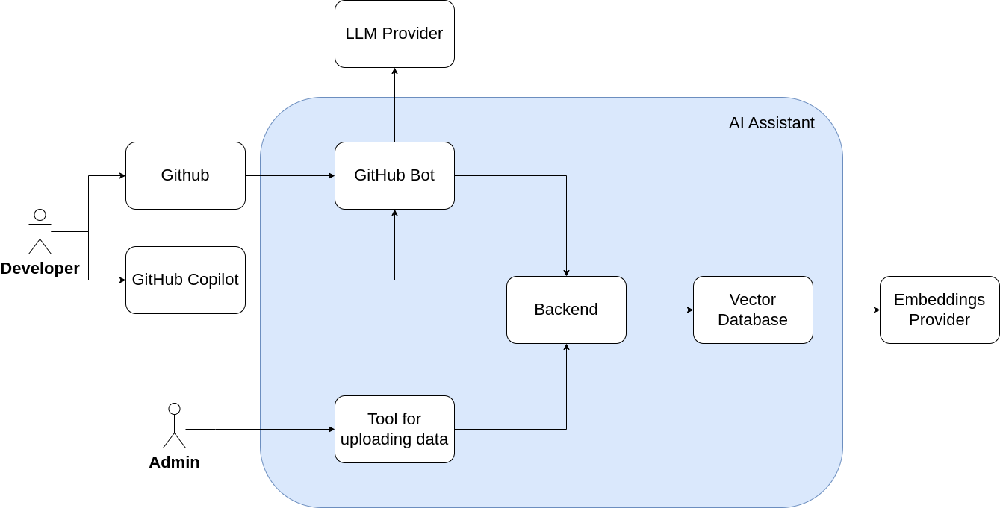

# GitmateAI

AI-driven github bot can automate tasks such as issue tracking, pull request management, and code reviews, streamlining
the development process.



## Application Overview

Application consists of 5 modules:

- `gitmateai-backend` - Manages information chunks for issues, pull requests (PRs), commits, code base, and conventions.
- `gitmateai-bot` - Github bot that assists issue tracking, pull request management, and code reviews, streamlining the
  development process.
- `gitmateai-loader-cli` - A CLI tool that retrieves content from specific organizations, repositories, or users and
  populates the vector database with this information.
- `weaviate` - An open-source vector database that stores both objects and vectors, enabling the combination of vector
  search with structured filtering. It offers the fault tolerance and scalability of a cloud-native database.
- `ollama` - : A lightweight, extensible framework for building and running language models on a local machine. It
  provides a simple API for creating, running, and managing models, along with a library of pre-built models for various
  applications.

## Development Setup

To set up the development environment, use [`docker-compose.dev.yml`](./docker-compose.dev.yml), which runs the vector
database alongside Ollama with the embedded model.

### Running the Gitmate-Backend

To start the GitmateAI backend in development mode, follow these steps:

1. Set the environment variables in the `.env` file. You can use the [`.env.example`](./gitmateai-backend/.env.example)
   file as a reference.

<a id="gitmateai-backend-env"></a>

| Variable Name   | Description                                    | Default Value            |
|-----------------|------------------------------------------------|--------------------------|
| `DATABASE_HOST` | Host address for the vector database(weaviate) | `localhost`              |
| `DATABASE_PORT` | Port number for the vector database(weaviate)  | `8080`                   |
| `OLLAMA_URL`    | URL for the Ollama service                     | `http://localhost:11434` |

2. Run the following command to start the GitmateAI backend:

```bash
cd gitmateai-backend
npm install  
npm run start:dev
```

Backend runs on `http://localhost:3001/v1` by default.

### Guide to Register Your Bot on GitHub and GithubCopilot, and Configure the GitmateAI-bot

#### Guide to register your bot on GitHub and configure environment variables

```bash
cd gitmateai-bot
npm install  
npm run build
npm run start
```

1. Next follow instructions to visit http://localhost:3000 (or your custom Glitch URL).
2. Go ahead and click the Register a GitHub App button.
3. Next, you'll get to decide on an app name that isn't already taken. Note: if you see a message "Name is already in
   use" although no such app exists, it means that a GitHub organization with that name exists and cannot be used as an
   app name.
4. After registering your GitHub App, you'll be redirected to install the app on any repositories. At the same time, you
   can check your local .env and notice it will be populated with values GitHub sends us in the course of that redirect.
5. Stop the server in your terminal
6. Configure environment variables in `.env`. Most of the variables will be set automatically when you register your bot
   with Probot,
   but some of the following variables need to be set manually:

   <a id="gitmateai-bot-env"></a>

   | Variable Name            | Description                                                                                   |
   |--------------------------|-----------------------------------------------------------------------------------------------|
   | `WEBHOOK_PROXY_URL`      | URL for tunneling GitHub webhooks(it is needed only for development)                          |
   | `WEBHOOK_SECRET`         | Secret key for webhook validation                                                             | 
   | `APP_ID`                 | GitHub App identifier                                                                         | 
   | `APP_NAME`               | Name of the GitHub App                                                                        | 
   | `ORGANIZATION_NAME`      | GitHub Organization name                                                                      |
   | `PRIVATE_KEY`            | Private key for GitHub App auth                                                               | 
   | `GITHUB_CLIENT_ID`       | GitHub OAuth client ID                                                                        | 
   | `GITHUB_CLIENT_SECRET`   | GitHub OAuth client secret                                                                    | 
   | `LLM_API_KEY`            | API key for the LLM service                                                                   | 
   | `LLM_MODEL_NAME`         | Name of the LLM model                                                                         | 
   | `BACKEND_URL`            | URL for the backend API                                                                       | 
   | `PREFIX`                 | This prefix will be used for bot specific commands(e.g. /gitmateai help, prefix is gitmateai) | 

7. Start the server in you terminal with `npm run start`:

#### Guide to enable automated task for organization repositories
[`github-config.json`](./github-config.json) file contains the configuration for the bot. You can set automated tasks for each repository.
To do this, you need to replace the owner with your organization name, repo with the repository name for what you want to configure automated tasks
and `automatedServices` property with the list of automated tasks from the tasks list. 

```json
{
  "owner": {
    "repo": {
      "automatedServices": [
        "task name"
      ]
    }
  }
}
```

Issue automated tasks:

| Task                  | Description                     |
|-----------------------|---------------------------------|
| `issue-label`         | Assign a label to the issue     |
| `issue-code-search`   | Search similar to issue code    |
| `issue-commit-search` | Search similar to issue commits |
| `issue-pr-search`     | Search similar to issue PRs     |
| `issue-issues-search` | Search similar to issue issues  |
| `issue-summarize`     | Summarize issue                 |


Pull Request automated tasks:

| Task           | Description              |
|----------------|--------------------------|
| `pr-label`     | Assign a label to the PR |
| `pr-summarize` | Summarize Pull Request   |


#### Guide to enable copilot assistance for the bot

1. Visit `Settings -> Developer settings -> GitHub Apps -> Your GitHub App -> General` and find Callback URL.
   Put https://github.com/ to it.
2. Visit `Permissions and events -> Account permissions -> Copilot` and set to read-only.
3. Visit `Copilot` and enable it by clicking on checkboxes.
4. Set `Add Type` to agent
5. Then you need to set URL by `http://[address of your tunnel or public address]/copilot`

After these steps you can authorize in GitHub Copilot chat with your personal account.

### GitmateAI-Loader-CLI - Populating the Database with Data Chunks.

```bash
cd gitmateai-loader-cli
```

Before running the scripts, you need to configure the .env file with the required environment variables,
see [.env.example](gitmateai-loader-cli/.env.example).
This includes setting the backend URL where all the information will be pushed and providing your GitHub access token.

To generate a GitHub access token, follow these steps:

1. In the upper-right corner of any page on GitHub, click your profile photo, then click Settings.

2. In the left sidebar, click Developer settings.

3. In the left sidebar, under Personal access tokens, click Fine-grained tokens.

4. Click Generate new token.

5. Assign this token to the 'GITHUB_TOKEN' variable.

You should also specify which repositories are marked as knowledge bases so the bot can answer questions about them.
To do this, edit the [`knowledge-bases.json`](./gitmateai-loader-cli/knowledge-bases.json) file and add the repositories you want to mark as knowledge bases, like this:

```json
{
   "knowledge_bases": [
      {
         "owner": "palagdan",
         "repo": "palagdan-knowledge-base"
      }
   ]
}
```

```markdown
Usage: gitmate-loader-cli [options] [command]

CLI tool to fetch and process GitHub repositories

Options:
-V, --version output the version number
-h, --help display help for command

Commands:
org <orgName>           Load repositories from an organization and and send all its details to the specified backend.
user <username>         Load repositories for a specific GitHub user and send all its details to the specified backend.
repo <name> <repoName>  Retrieve a specific repository from a user or an organization and send all its details to the
specified backend.
help [command]          display help for command
```

> **🚨 Important:** To use the `gitmate-loader-cli` command, you must install it globally. Otherwise, use the commands
> provided below.

```bash
cd gitmateai-loader-cli
npm install
npm run build
npm run start [options] [command] 
```

If you wish to exclude specific file extensions from being retrieved and stored, add them to the `.gitmateignore` file.

## Production Setup

1. You should create `.env` file in the root directory and set the environment variables
   from [gitmateai-bot](#gitmateai-bot-env) and [gitmateai-backend](#gitmateai-backend-env) sections.
2. Then use [`docker-compose.prod.yml`](./docker-compose.prod.yml), which sets up all necessary services. Run the
   following command:

```bash
docker-compose -f docker-compose.prod.yml up -d
```


